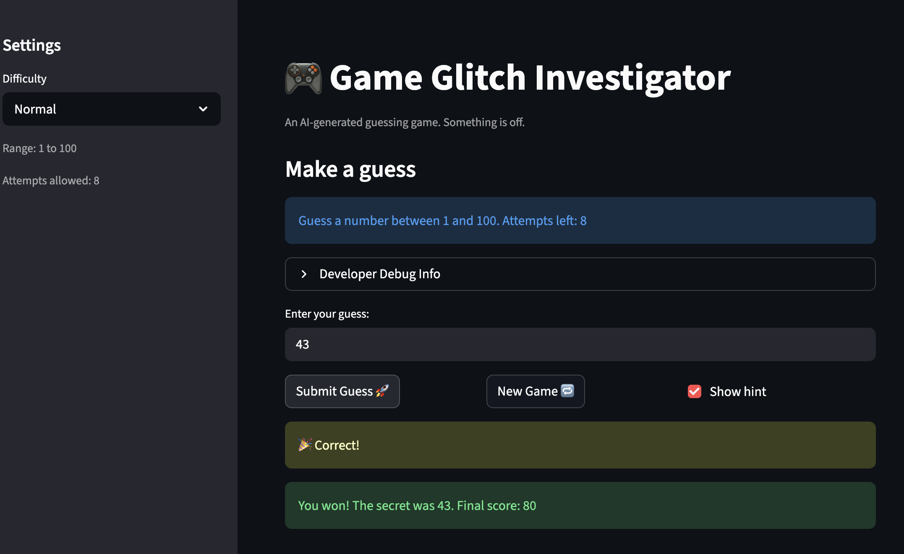

# 🎮 Game Glitch Investigator: The Impossible Guesser

## 🚨 The Situation

You asked an AI to build a simple "Number Guessing Game" using Streamlit.
It wrote the code, ran away, and now the game is unplayable. 

- You can't win.
- The hints lie to you.
- The secret number seems to have commitment issues.

## 🛠️ Setup

1. Install dependencies: `pip install -r requirements.txt`
2. Run the broken app: `python -m streamlit run app.py`

## 🕵️‍♂️ Your Mission

1. **Play the game.** Open the "Developer Debug Info" tab in the app to see the secret number. Try to win.
2. **Find the State Bug.** Why does the secret number change every time you click "Submit"? Ask ChatGPT: *"How do I keep a variable from resetting in Streamlit when I click a button?"*
3. **Fix the Logic.** The hints ("Higher/Lower") are wrong. Fix them.
4. **Refactor & Test.** - Move the logic into `logic_utils.py`.
   - Run `pytest` in your terminal.
   - Keep fixing until all tests pass!

## 📝 Document Your Experience

- [x] Describe the game's purpose.
   - The game challenges the player to guess a secret number within a limited number of attempts, with hints and scoring feedback after each guess.
- [x] Detail which bugs you found.
   - Hints were reversed ("Go HIGHER" appeared when the guess was too high).
   - Attempts were off by one, causing "Out of attempts" too early.
   - The game could remain stuck in a non-playing/game-over state after starting a new game.
- [x] Explain what fixes you applied.
   - Corrected `check_guess` hint direction so too-high guesses return "Go LOWER" and too-low guesses return "Go HIGHER".
   - Fixed attempt counting by initializing `st.session_state.attempts` to `0`.
   - Refactored game logic into `logic_utils.py` and updated `app.py` to import shared logic functions.
   - Added/updated pytest coverage and verified behavior with a full test run (`28 passed`).

## 📸 Demo

- [x] Fixed winning game screenshot

## 🚀 Stretch Features

- [ ] [If you choose to complete Challenge 4, insert a screenshot of your Enhanced Game UI here]
